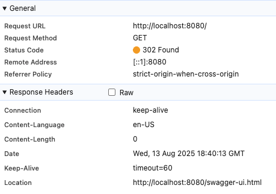
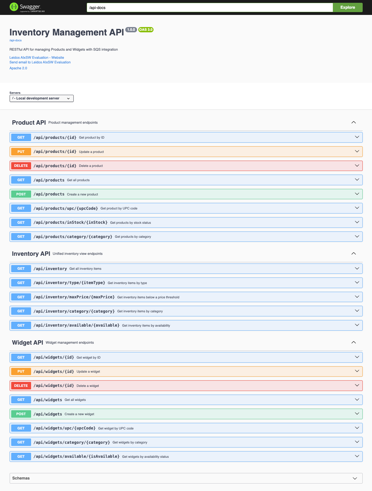
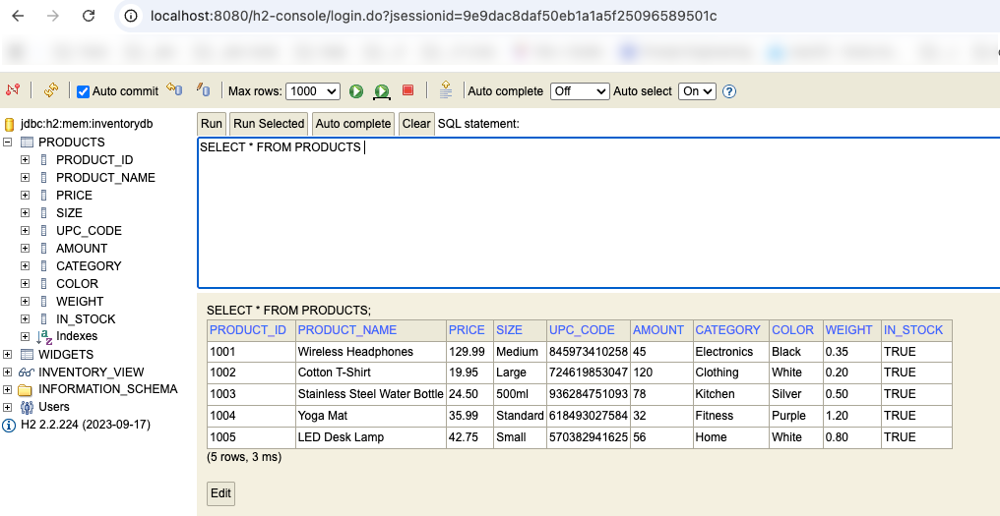
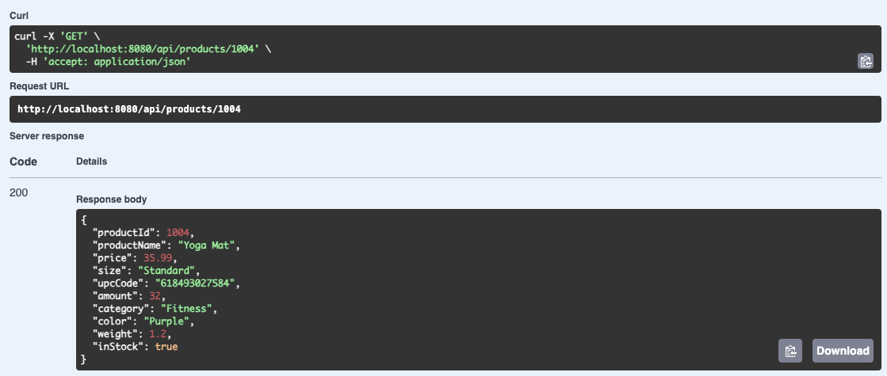
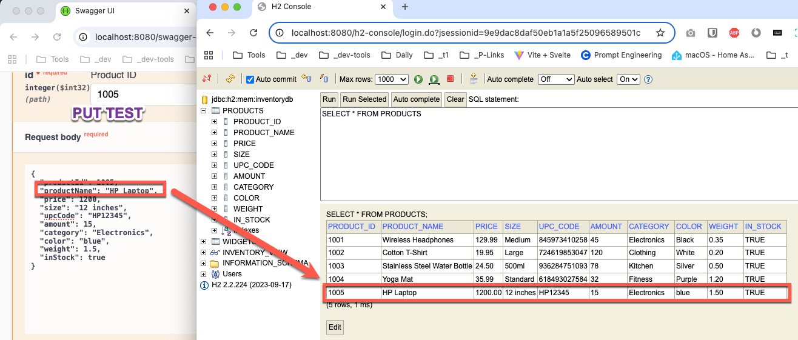

# Evaluate Claude Code 

This project contains all of my research around Claude Code evaluation and supporting artifacts.

## Disclaimer
_This project was done as an experiment spearheaded by Leidos as part of an AI evaluation process that I participated in as an employee/engineer. The requirement specification artifact and sample dataset (not real data) was provided by the project lead. All other artifacts, including code, comments and transcripts where either produced by me or generated by Claude Code. There is no proprietary data that belongs to Leidos or my current customer in this repository. This is a 'hello world' implementation using Claude Code to test it's capabilities. The data contained in the sample set are not real. The comments reflected here are solely mine and do not reflect the perspectives or views shared by the company or my customer in any manner._

_I am sharing this project in hopes that the knowledge gained in using the AI tool, vibe/prompt coding process will help enable and foster a learning environment for others to follow._ 

_Now on with the show..._

## Requirements
Create a new microservice that will allow users to interact with and ingest data. There will be two components to the service: a REST API to enact CRUD actions on specific data objects, and an SQS queue to ingest those same objects and store them in the in-memory db. In a real scenario these would likely be 2 separate microservices, one to drop data to ingest on the SQS queue, and one to poll the SQS queue and actually store the data. For simplicity in this example, we will just use one service to implement both components. In order to test, developers must demonstrate the API actions through a Swagger interface and show the objects for CUD operations are sent to the SQS queue and subsequently polled and processed.

More details can be found here in the [requirements-specification](requirements.md).

<a href="requirements.md" target="_blank" alt="Requirement: Swimlanes Described">

 
</a>

_click for a larger view_

## What components does it evaluate?
- Claude Code's ability to create a starter project from scratch.
- Claude Code leveraging the following aspects:
  - Spring Boot / Java
  - H2 in-memory database
  - Amazon SQS (Simple Query Service queue)
  - Docker Containerization
  - Vide coding
  - Analysis of starter DB Schema files.
  - Leverage Amazon Bedrock AI for Anthropic API support.
    - Models Used: 
      - us.anthropic.claude-3-7-sonnet-20250219-v1:0
      - us.anthropic.claude-3-5-haiku-20241022-v1:0
  - Unit Test generation
  - Documentation generation
  - Creation of background services

## Prompt Details

- To see how the requirements were mapped to an input prompt file, see [CLAUDE.md](./CLAUDE.md).
- Notes from the transcripts of the Claude Code prompt have been captured and placed under [transcript-1](./dev-notes/transcript-1.md) and [transcript-2](./dev-notes/transcript-2.md)

## Environment Setup and Secrets (ssshhhh!)

- File [sample_claude_settings.json](sample_claude_settings.json) file contains the sample artifact for Claude settings file. It should be dropped at "./.claude/settings.json" path.
- Similarly, a [sample.env](./inv-mgt-ms-app/sample.env) file has been provided that should contain all the secrets that you can fill in. This file should be renamed and placed under "./inv-mgt-ms-app/.env" path.
- All sample data and schema have been provided under [sample-data](./sample-data/) folder.

## Notes

- The code generated under [/inv-mgt-ms-app/](/inv-mgt-ms-app/) is the resulting artifact. The [README.md](./inv-mgt-ms-app/README.md) contains the detils of what was implemented.

## Questions?

If you have any questions, feel free to reach out to me at [DigitalRiver.blog](https://digitalriver.blog/)

Cheers! 🍻

## Screenshots
 

Landing Page Redirect Verification:

Swagger Documentation Verification:

GET - Product Listing REST API Verification:

GET a single Product REST API Verification:

PUT a single Product REST API Verification:

