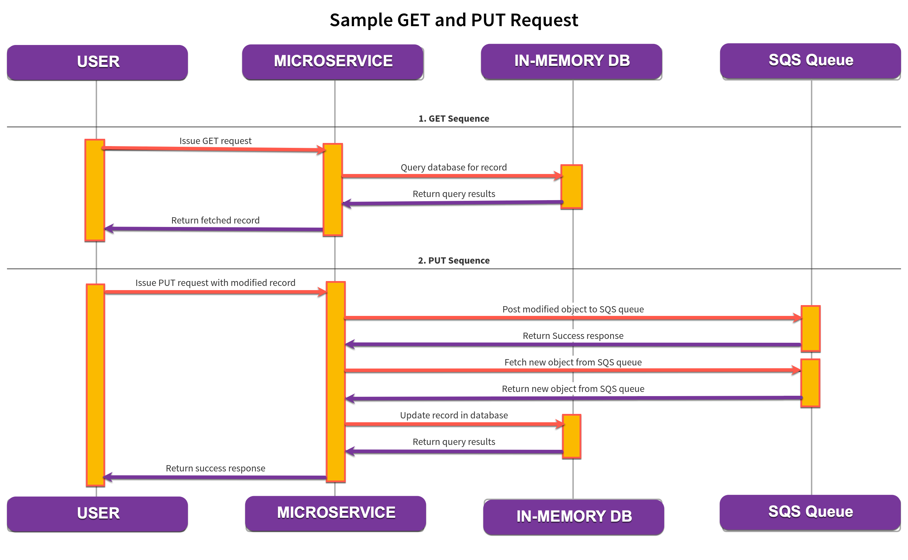

# Inventory Management Microservice Application

_This is part 1 or 2 evaluations_

## Objective
Create a new microservice that will allow users to interact with and ingest data. There will be two components to the service: a REST API to enact CRUD actions on specific data objects, and an SQS queue to ingest those same objects and store them in the in-memory db. In a real scenario these would likely be two separate microservices, one to drop data to ingest on the SQS queue, and one to poll the SQS queue and actually store the data. For simplicity in this example, we will just use one service to implement both components. In order to test, developers must demonstrate the API actions through a Swagger interface and show the objects for CUD operations are sent to the SQS queue and subsequently polled and processed.

## Goal(s)
Demonstrate how the AI tool can help with “blank canvas” problems where it can easily stand up and create projects from scratch so developers can immediately begin working on something and arrive at functioning software faster.

## Sample Sequence Diagram
 

## Prerequisites
- Data definitions for desired objects (see [sample data](/sample-data/) in repository)
- AWS access keys

## Tasks
- Create Spring Boot service to deploy API:
  - Create and deploy the microservice as a Spring Boot application so it can run as a standalone service.
- Create REST API using OpenAPI: 
  - All REST API endpoints should be exposed via OpenAPI Swagger for documenatation and testing.
- Store objects in in-memory H2 database operating using the H2 'postgresql' dialect.
  - Create an in-memory database as part of the microservice to hold data. See attached SQL file: 'data/init_database.sql'.
  - Define data structures required to store the data.
- Create CRUD endpoints for 'Product':
  - Define API endpoints for product that can create, delete, update, and read products. 
  - Only the read operation will connect directly to the database.
- Create CRUD endpoints for 'Widget':
  - Define API endpoints for widget that can create, delete, update, and read widgets. 
  - Only the read operation will connect directly to the database.
- During startup, ensure that the SQS 'Product' queue with name `{your_name}_product_queue` exists.
  - If it does not exist, create it.
- During startup, ensure that the SQS 'Widget' queue with name `{your_name}_widget_queue` exists.
  - If it does not exist, create it.
- Implement 'Product' publisher (SQS with queue name `{your_name}_product_queue`):
  - In the create, delete, and update endpoints, send the new/modified/deleted product to the SQS queue.
- Implement 'Widget' publisher (SQS with queue name `{your_name}_widget_queue`):
  - In the create, delete, and update endpoints, send the new/modified/deleted widget to the SQS queue.
- Implement 'Product' consumer (SQS with queue name `{your_name}_product_queue`):
  - Implement a polling strategy to pick new/modified/deleted products off the product queue and update the in-memory database accordingly.
- Implement 'Widget' consumer (SQS with queue name `{your_name}_widget_queue`):
  - Implement a polling strategy to pick new/modified/deleted widgets off the widget queue and update the in-memory database accordingly.
- All code should have unit tests with instructions on how to run the tests.
- Containerize the microservice:
  - Create a container to run the deployed microservice and document how to run the container.
- Document the codebase:
  - Develop documentation for the code base (internal code and deployment instructions).